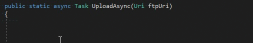
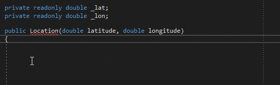

# Code Snippets

To use the code snippets on Visual Studio, copy the `guard-cs.vs.snippet` file into a folder that is
recognized by the Visual Studio Code Snippets Manager. You can go to `Tools` > `Code Snippets Manager`
(<kbd>CTRL+K</kbd>, <kbd>CTRL+B</kbd>) in Visual Studio to list these folders or to add a new one.

The following folder should be recognized by default (don't forget to replace 2017 with your own
Visual Studio version):
`%userprofile%\Documents\Visual Studio 2017\Code Snippets\Visual C#\My Code Snippets`

## Usage

All shortcuts start with "g".
* ga -> `Guard.Argument(arg, nameof(arg))`
* gnn -> `Guard.Argument(arg, nameof(arg)).NotNull()`

"n" is used for negation:
* ghf -> `Guard.Argument(arg, nameof(arg)).HasFlag()`
* g**n**hf -> `Guard.Argument(arg, nameof(arg)).DoesNotHaveFlag()`

"x" is used for prefixing the validation with a null check:
* gnw -> `Guard.Argument(arg, nameof(arg)).NotWhiteSpace()`
* g**x**nw -> `Guard.Argument(arg, nameof(arg)).NotNull().NotWhiteSpace()`

Most words are represented by single letters:
* `gm` for "Guard.**M**atches"
* `gz` for "Guard.**Z**ero"
* `gr` for "Guard.In**R**ange"

But some are represented by multiple letters:
* abs = "Absolute"
* cast = "Cast"
* clone = "Clone"
* comp = "Compatible"
* con = "Contains"
* dis = "Disposal"
* em = "Empty"
* end = "Ends"
* eq = "Equals"
* http = "Http"
* https = "Https"
* inf = "Infinity"
* mem = "Member"
* min = "Min"
* max = "Max"
* mod = "Modify"
* nan = "NaN"
* neg = "Negative"
* op = "Operation"
* pos = "Positive"
* rel = "Relative"
* req = "Require"
* sch = "Scheme"
* start = "Starts"
* sup = "Support"
* wrap = "Wrap"

## Samples

### Require the argument to be a non-null, FTP URI.

We always start with "g"; we want to prefix the validation with `NotNull`, so we add "x"; and we
want to specify a URI scheme and "sch" represents "Scheme". Now we have `gxsch`:

After typing its shortcut, Visual Studio allows us to insert the snippet by hitting <kbd>Tab</kbd>
twice. Once inserted, we can again use <kbd>Tab</kbd> to move the cursor between tabstops ("arg" and
"scheme" parts). So we move to "scheme" with one tab and type "ftp" as our scheme. We then hit
<kbd>Enter</kbd> to complete.

After completion, the cursor is positioned before the semicolon (";"). This is for easier chaining
of additional validations. You can use <kbd>Shift+Enter</kbd> instead to start a newline without
taking the semicolon to the next line.

### Require a number to be in range.

We start with "g"; we want to validate range, so we add "r", for "range". Now we have `gr`:

Like the above example, we hit <kbd>Tab</kbd> twice to insert the snippet and again with
<kbd>Tab</kbd>, navigate through the tabstops ("arg", "minValue" and "maxValue").
